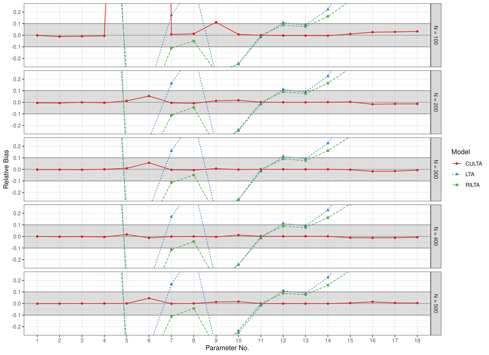
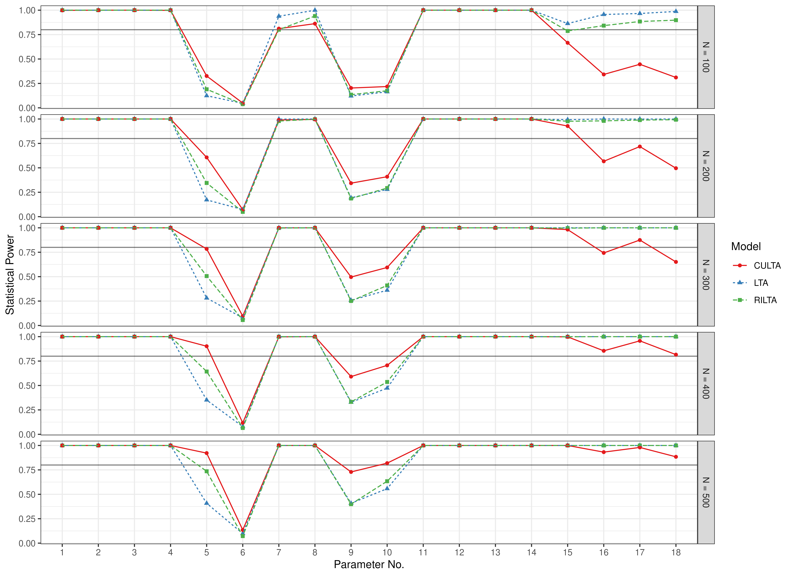

# Scatter Plots - LTA Estimates

``` r

library(manCULTA)
```

## Bias

``` r

data(results_lta_est, package = "manCULTA")
FigBiasLTAEst(results_lta_est = results_lta_est)
```



## Root Mean Square Error (RMSE)

``` r

data(results_lta_est, package = "manCULTA")
FigRMSELTAEst(results_lta_est = results_lta_est)
```


## Coverage Probability

``` r

data(results_lta_est, package = "manCULTA")
FigCoverageLTAEst(results_lta_est = results_lta_est)
```


## Statistical Power

``` r

data(results_lta_est, package = "manCULTA")
FigPowerLTAEst(results_lta_est = results_lta_est)
```



## Parameters

The parameters are indexed as follows:

1.  $`\theta_{11}`$ parameter.  
    Unique state variance for item 1.

2.  $`\theta_{22}`$ parameter.  
    Unique state variance for item 2.

3.  $`\theta_{33}`$ parameter.  
    Unique state variance for item 3.

4.  $`\theta_{44}`$ parameter.  
    Unique state variance for item 4.

5.  $`\nu_{0}`$ parameter.  
    Intercept for initial log-odds of profile 0 (vs. profile 1) when
    $`X = 0`$.

6.  $`\kappa_{0}`$ parameter.  
    Covariate effect on initial profile membership; higher $`X`$
    increases odds of profile 0.

7.  $`\alpha_{0}`$ parameter.  
    Baseline log-odds of being in profile 0 across days.

8.  $`\beta_{00}`$ parameter.  
    Increased odds of staying in profile 0 if previously in that
    profile; reflects persistence.

9.  $`\gamma_{00}`$ parameter.  
    Covariate effect on staying in profile 0; higher $`X`$ increases
    persistence.

10. $`\gamma_{10}`$ parameter.  
    Covariate effect on switching from state to profile 0; higher $`X`$
    increases transition odds.

11. $`\mu_{10}`$ parameter.  
    Profile specific mean for profile 0 and item 1.

12. $`\mu_{20}`$ parameter.  
    Profile specific mean for profile 0 and item 2.

13. $`\mu_{30}`$ parameter.  
    Profile specific mean for profile 0 and item 3.

14. $`\mu_{40}`$ parameter.  
    Profile specific mean for profile 0 and item 4.

15. $`\mu_{11}`$ parameter.  
    Profile specific mean for profile 1 and item 1.

16. $`\mu_{21}`$ parameter.  
    Profile specific mean for profile 1 and item 2.

17. $`\mu_{31}`$ parameter.  
    Profile specific mean for profile 1 and item 3.

18. $`\mu_{41}`$ parameter.  
    Profile specific mean for profile 1 and item 4.
