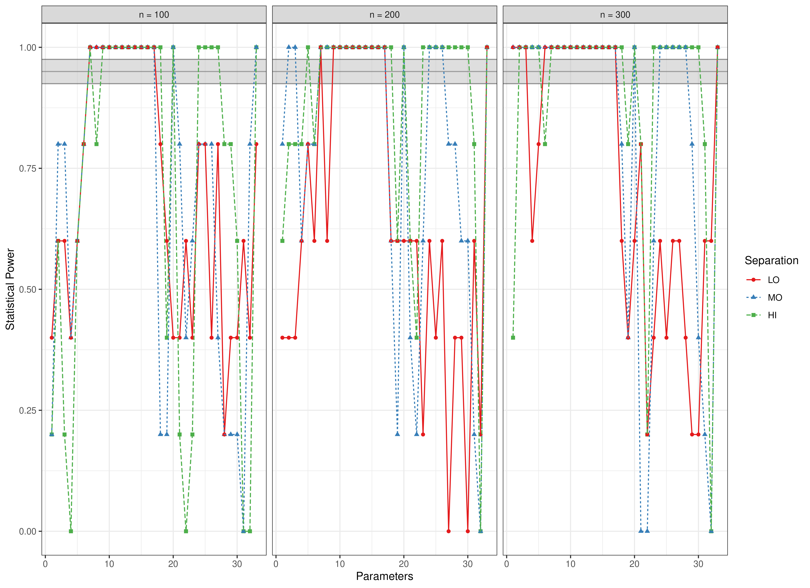
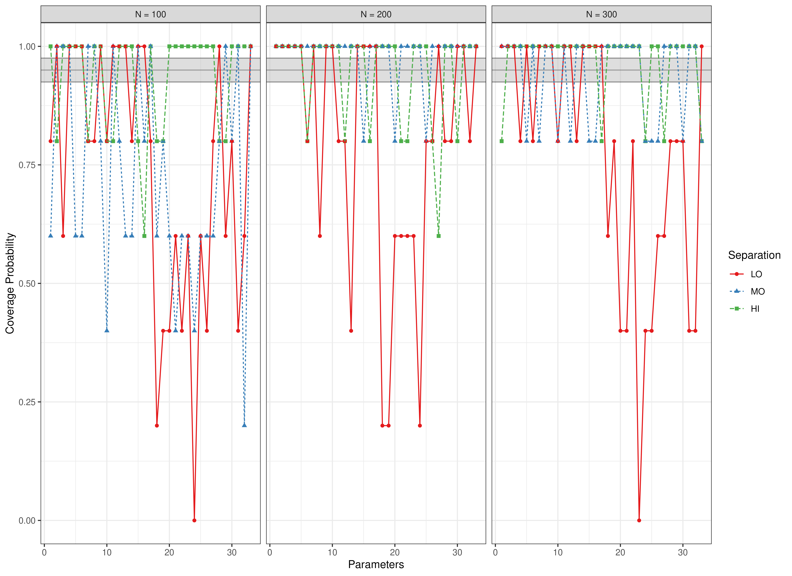

``` r
library(manCULTA)
```
## Bias


``` r
data(results_culta_est, package = "manCULTA")
FigBiasCULTAEst(results_culta_est = results_culta_est)
```


## Coverage


``` r
data(results_culta_est, package = "manCULTA")
FigCoverageCULTAEst(results_culta_est = results_culta_est)
```


## Power


``` r
data(results_culta_est, package = "manCULTA")
FigPowerCULTAEst(results_culta_est = results_culta_est)
```




