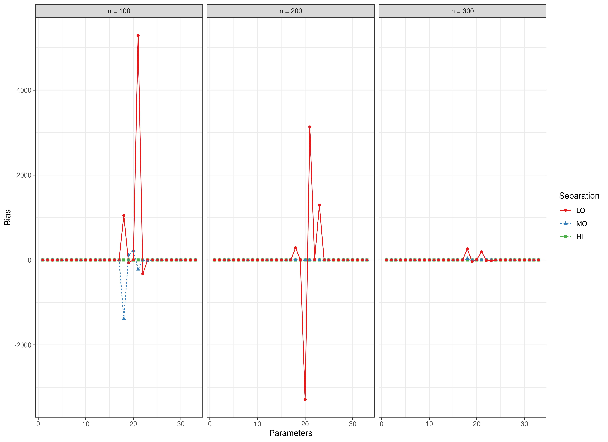
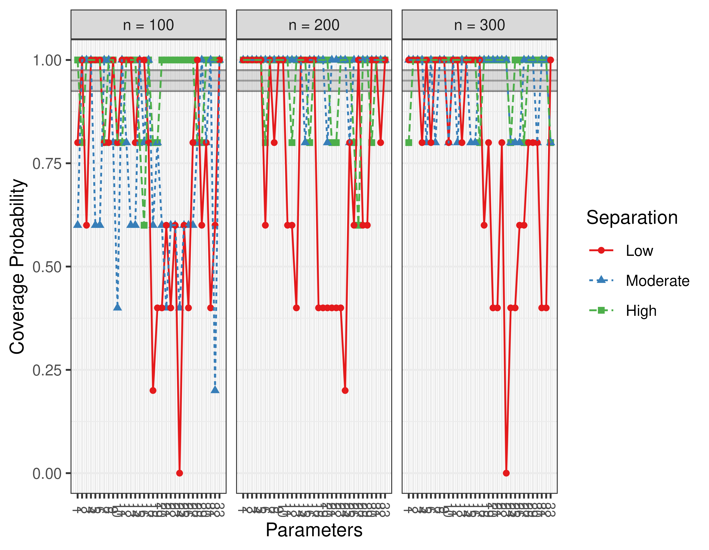
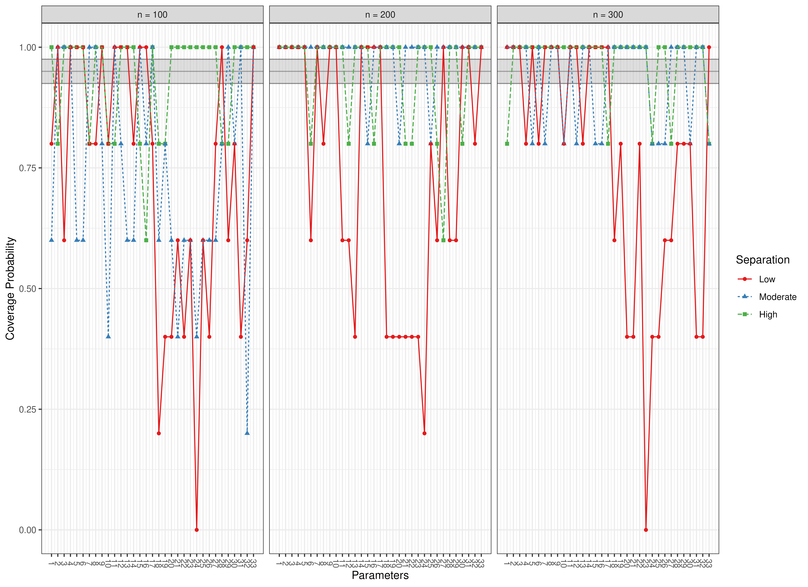

``` r
library(manCULTA)
```
## Bias


``` r
data(results_culta_est, package = "manCULTA")
FigBiasCULTAEst(results_culta_est = results_culta_est)
```




## Coverage


``` r
data(results_culta_est, package = "manCULTA")
FigCoverageCULTAEst(results_culta_est = results_culta_est)
```





## Power


``` r
data(results_lta_est, package = "manCULTA")
FigPowerCULTAEst(results_lta_est = results_lta_est)
#> Error in FigPowerCULTAEst(results_lta_est = results_lta_est): unused argument (results_lta_est = results_lta_est)
```


```
#> Warning in data(FigPowerCULTAEst, package = "manCULTA"): data set
#> 'FigPowerCULTAEst' not found
#> Error in FigCoverageCULTAEst(results_lta_est = results_lta_est): unused argument (results_lta_est = results_lta_est)
```
