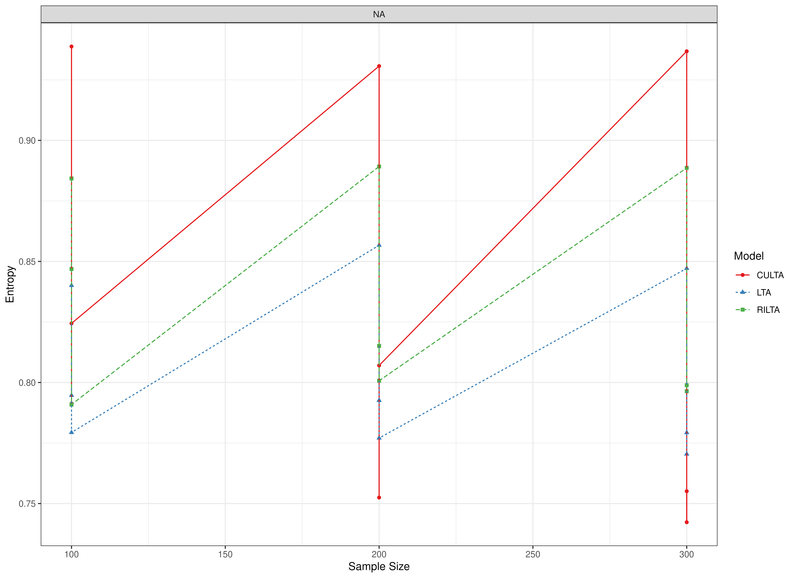
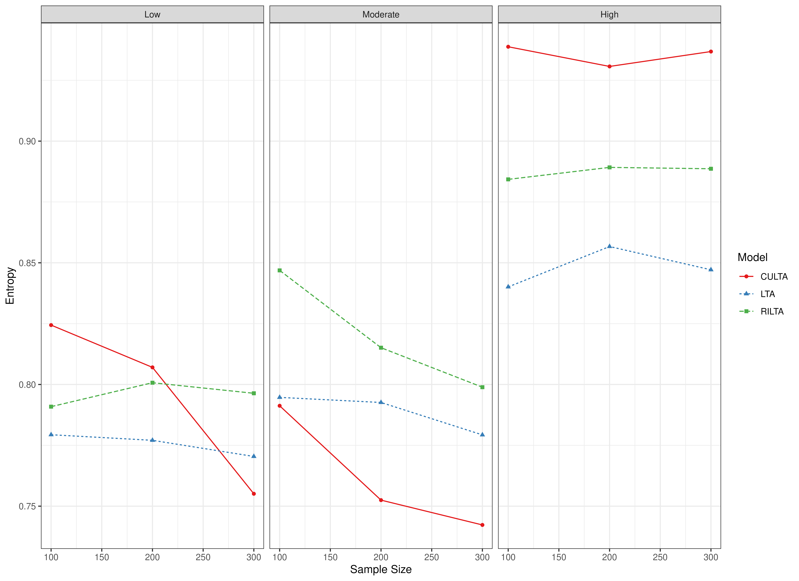

``` r
library(manCULTA)
```

## Average Entropy


``` r
data(results_entropy, package = "manCULTA")
FigEntropy(results_entropy = results_entropy)
#> `geom_line()`: Each group consists of only one observation.
#> ℹ Do you need to adjust the group aesthetic?
```




```
#> `geom_line()`: Each group consists of only one observation.
#> ℹ Do you need to adjust the group aesthetic?
```


