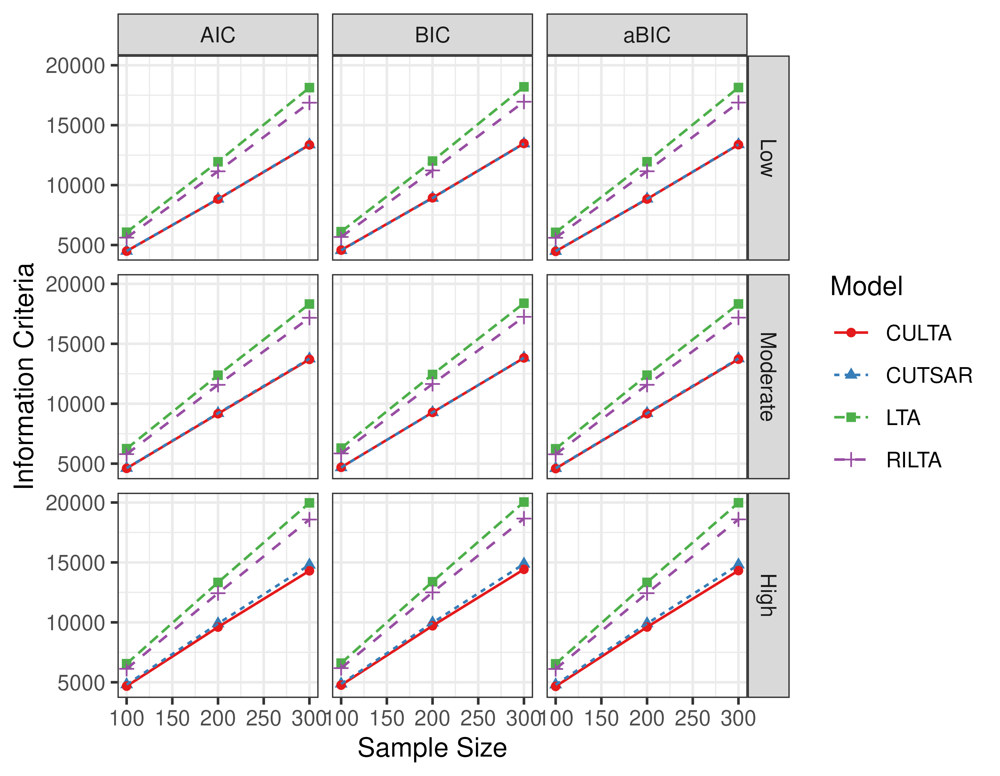
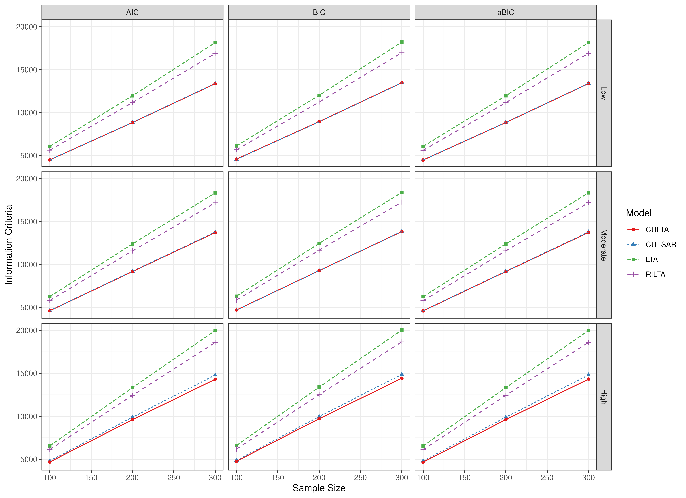

``` r
library(manCULTA)
```

## Average Information Criteria


``` r
data(results_ic, package = "manCULTA")
FigIC(results_ic = results_ic)
#> `geom_line()`: Each group consists of only one observation.
#> ℹ Do you need to adjust the group aesthetic?
#> `geom_line()`: Each group consists of only one observation.
#> ℹ Do you need to adjust the group aesthetic?
#> `geom_line()`: Each group consists of only one observation.
#> ℹ Do you need to adjust the group aesthetic?
```




```
#> `geom_line()`: Each group consists of only one observation.
#> ℹ Do you need to adjust the group aesthetic?
#> `geom_line()`: Each group consists of only one observation.
#> ℹ Do you need to adjust the group aesthetic?
#> `geom_line()`: Each group consists of only one observation.
#> ℹ Do you need to adjust the group aesthetic?
```


