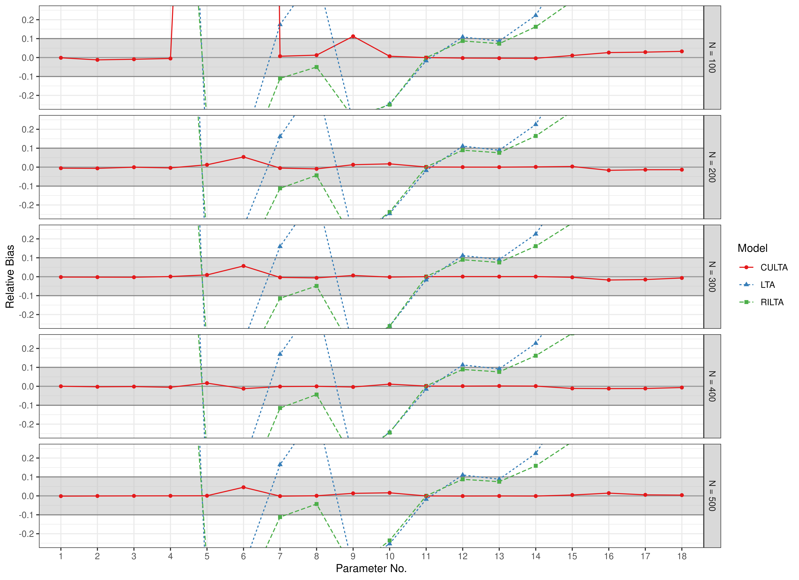
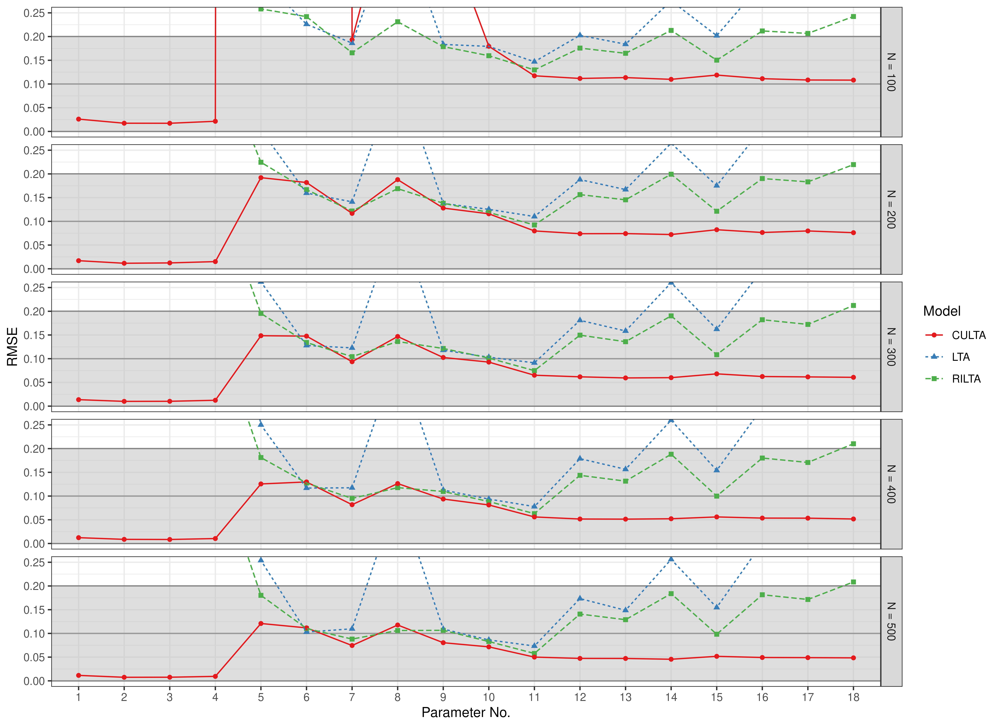
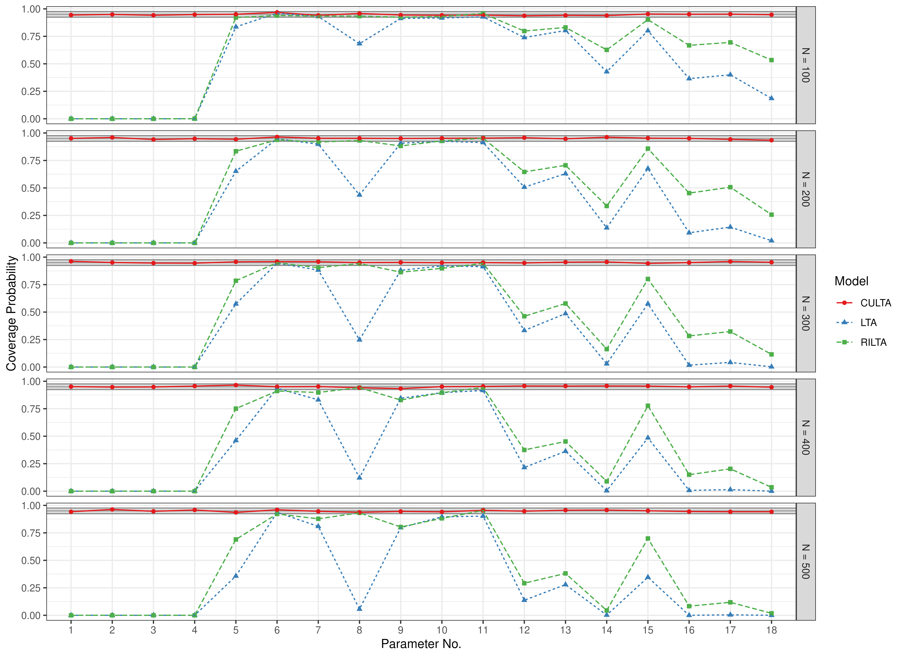
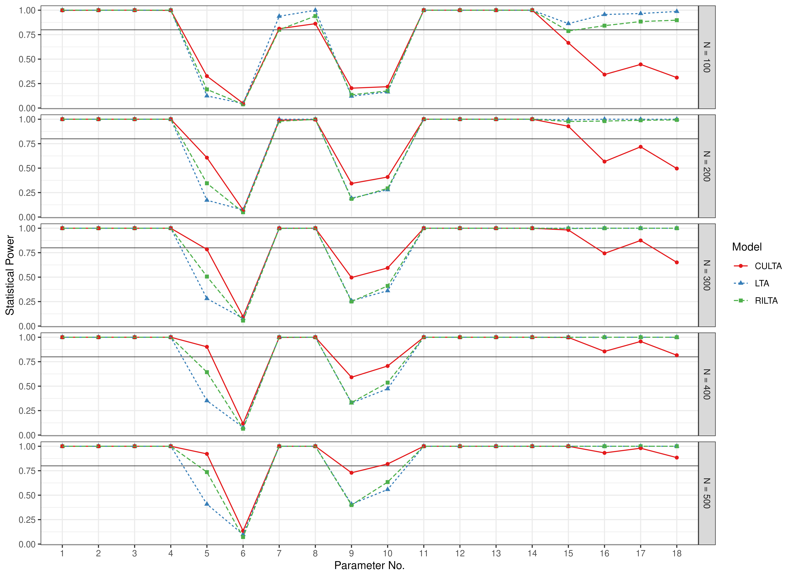

``` r
library(manCULTA)
```
## Bias


``` r
data(results_lta_est, package = "manCULTA")
FigBiasLTAEst(results_lta_est = results_lta_est)
```



## RMSE


``` r
data(results_lta_est, package = "manCULTA")
FigRMSELTAEst(results_lta_est = results_lta_est)
```



## Coverage


``` r
data(results_lta_est, package = "manCULTA")
FigCoverageLTAEst(results_lta_est = results_lta_est)
```



## Power


``` r
data(results_lta_est, package = "manCULTA")
FigPowerLTAEst(results_lta_est = results_lta_est)
```


