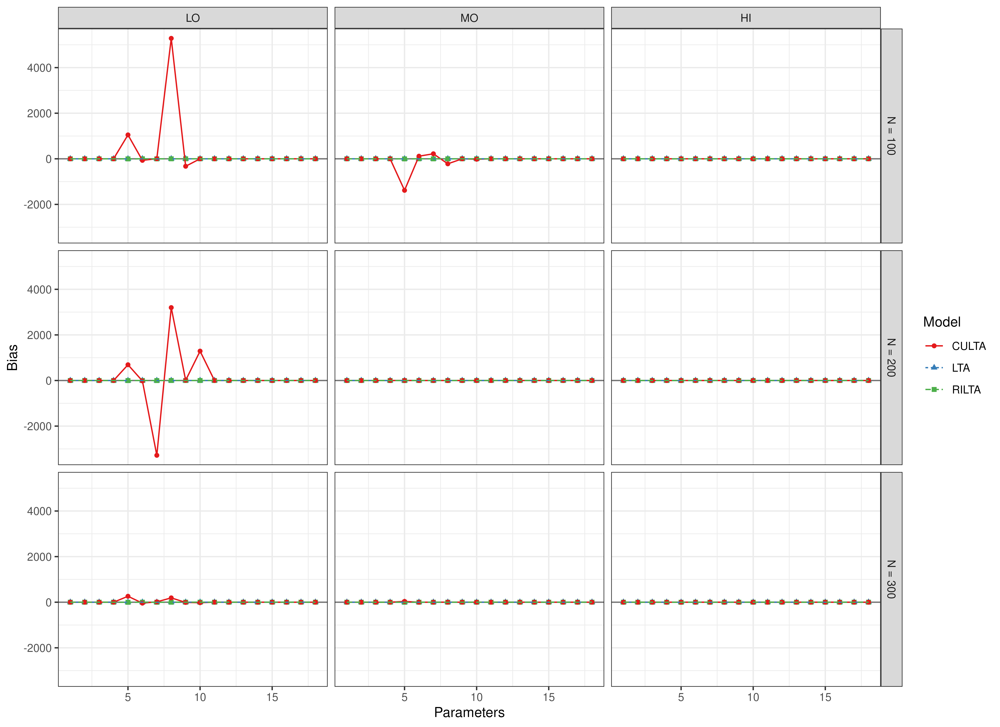
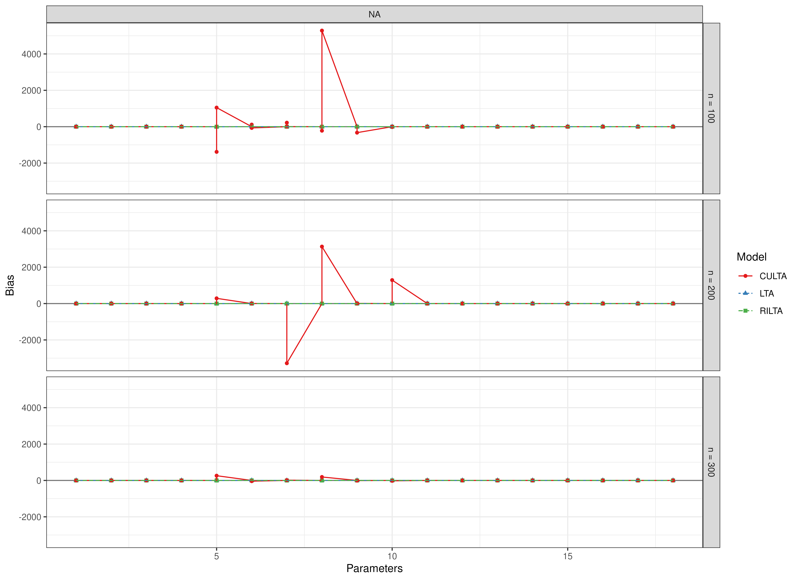
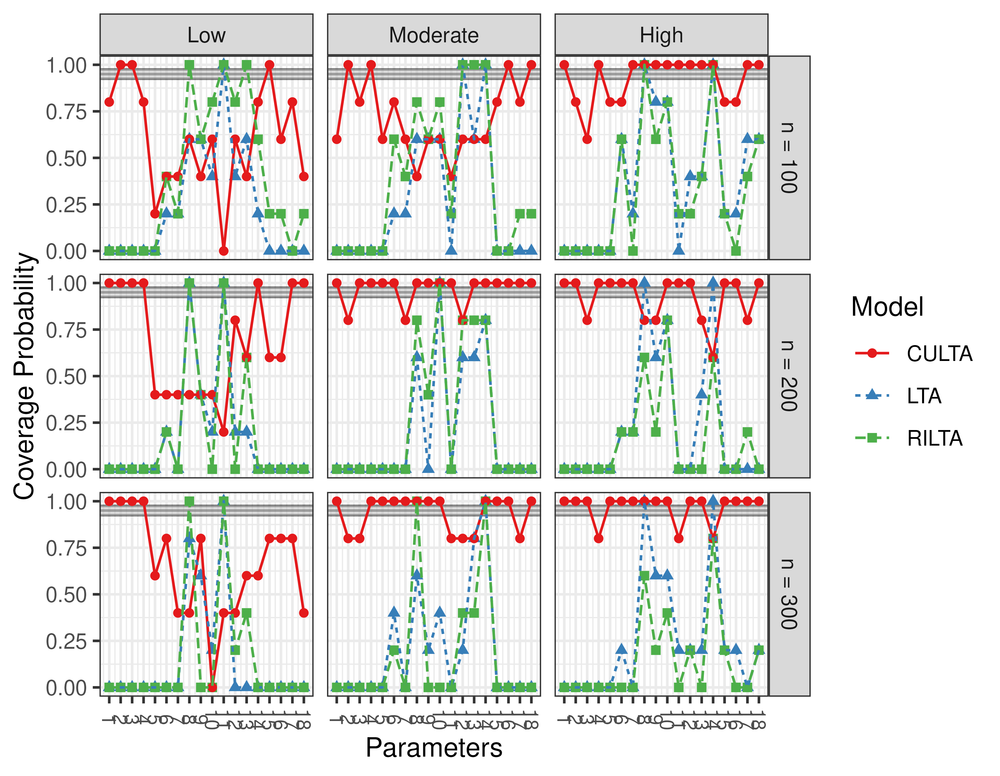
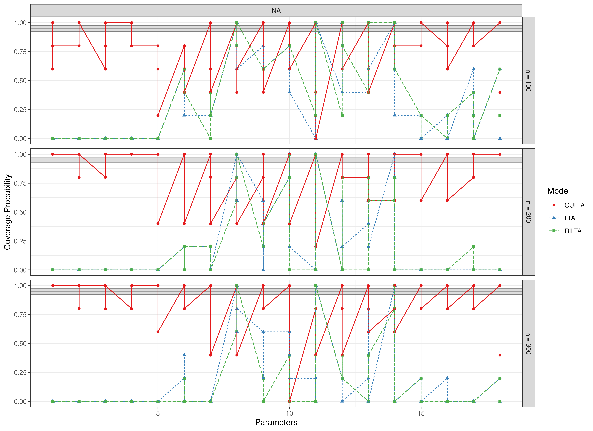
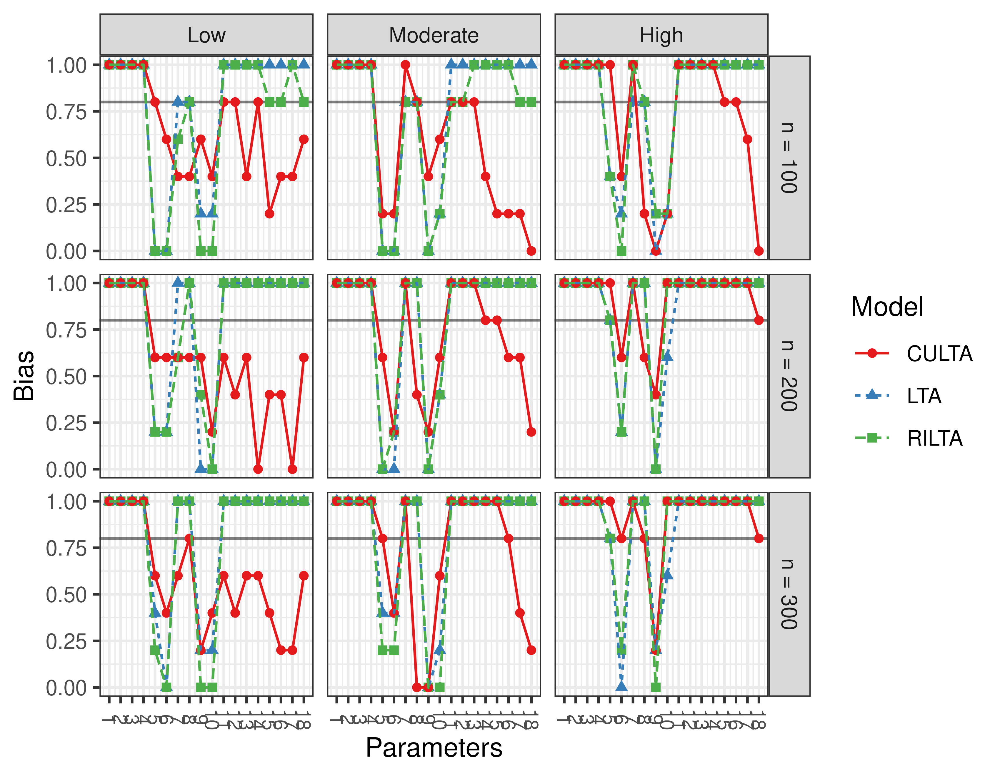
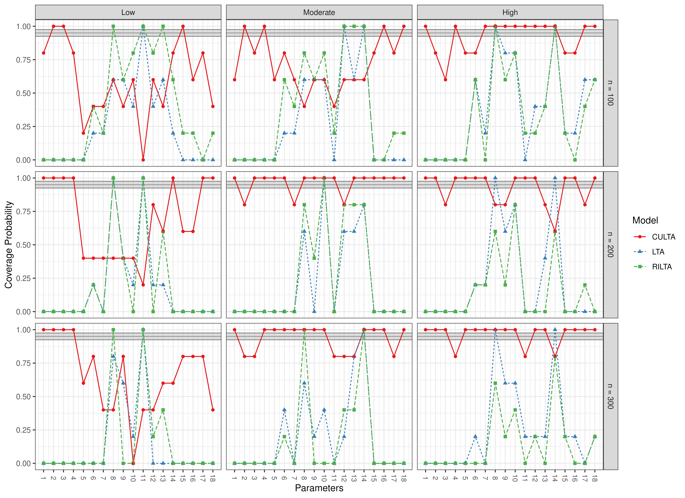

``` r
library(manCULTA)
```
## Bias


``` r
data(results_lta_est, package = "manCULTA")
FigBiasLTAEst(results_lta_est = results_lta_est)
```





## Coverage


``` r
data(results_lta_est, package = "manCULTA")
FigCoverageLTAEst(results_lta_est = results_lta_est)
```





## Power


``` r
data(results_lta_est, package = "manCULTA")
FigPowerLTAEst(results_lta_est = results_lta_est)
```




```
#> Warning in data(FigPowerLTAEst, package = "manCULTA"): data set
#> 'FigPowerLTAEst' not found
```


